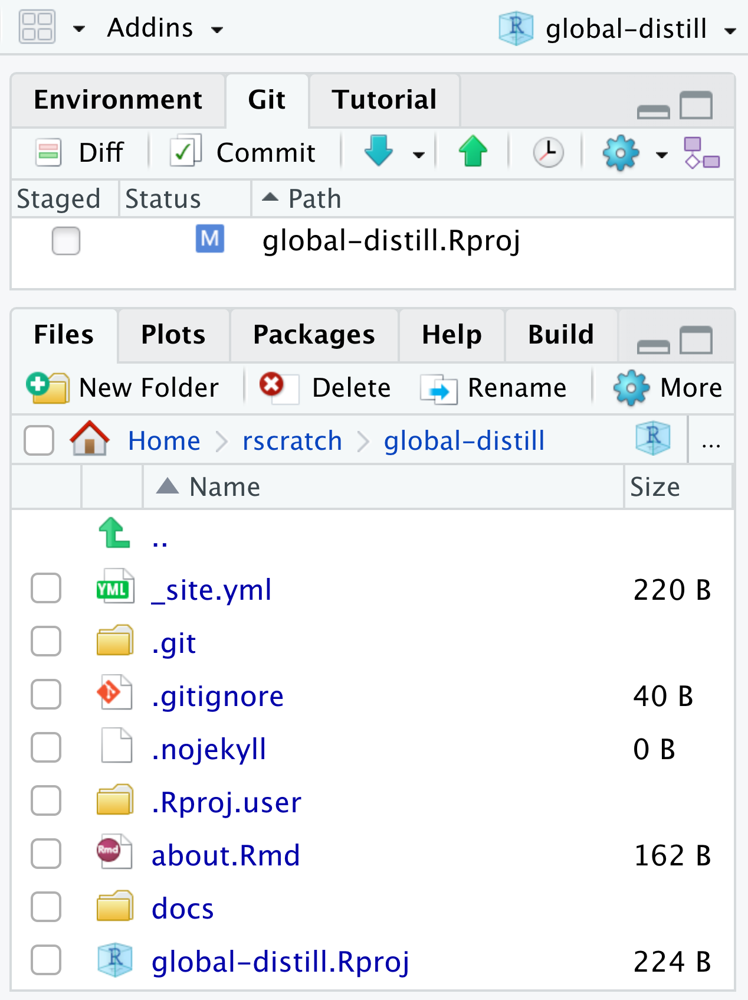
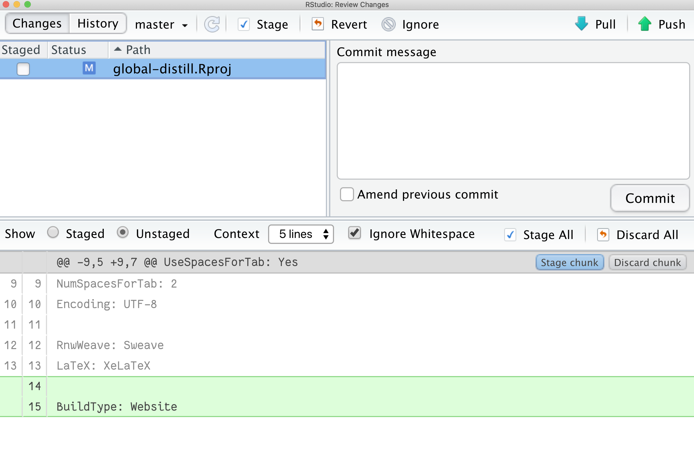

## Introduction  

**Moderators $W$ and $Z$**  

- Example Variables: 1 predictor *X*, 2 Moderators *W* & *Z*, 1 outcome *Y*  

- The primary IV (variable *X*) is continuous  

- The moderators are continuous  

```  
IV: Commitment  
MoDV1: Role Ambiguity  
MoDV2: Role Conflict  
DV: OP
```  

## How to run in SPSS Process Macro?  

1. Insert model framework image here.  

2. Analyze > Regression > PROCESS v4.0 by Andrew fF. Hayes  
    Insert image here...  

3. Insert variables (*Y*, *X*, *W*, and *Z*) and choose `Model 2`  
    Insert image here...  

4. Click Options button:  
    - check on `Generate code for visualizing interactions`  
    - Mean center - choose `Only continuous variables that define product`.  
    - Conditioning values - choose `-1SD, Mean, +1SD`  
    - click `Continue`
    insert image here ...  

5. click `OK` to run analysis  

## Reading the output  

- Model Summary, provides summary of model with *R*, $R^2$, $F$ statistic, and $p$ value for the overall model. Next, is the coefficients, with impact of Commitment, Role Ambiguity, Role Conflict, and the interaction effects to assess if there is moderation or not.  

- Culture has a significant impact on *OP*.  

- *RA* and its interaction with Culture (int_1) has a significant impact on *OP*. This shows that *RA* moderates the relationship between Culture and *OP*.  

- *RC* and its interaction with Culture (int_2) had an insignificant impact on *OP*. This shows that *RC* doesn't moderate the relationship between Culture and *OP*.  

Insert Second Output Image Here...  

- Test of unconditional interaction, this shows the change in $R^2$ due to interaction (X*W), this is significant.  

- Test of unconditional interaction, this shows the change in $R^2$ due to interaction (X*Z), this is significant.  

- Next, the conditional effects of the focal predictor at values of the moderator. 

## Pre-requisites

First, make sure you have the latest version of the distill package installed from CRAN:

    install.packages("distill")

Restart your R session. If you use RStudio, use the menu item *Session \> Restart R* or the associated keyboard shortcut:

-   <kbd>Ctrl + Shift + F10</kbd> (Windows and Linux) or
-   <kbd>Command + Shift + F10<kbd> (Mac OS).

```{=html}
<!-- -->
```
    packageVersion("distill")
    [1] ‘1.2’

## Create GitHub repo

Online.

## Clone GitHub repo

    usethis::create_from_github("https://github.com/apreshill/global-distill.git")

:sparkles: Commit & Push! :sparkles:

You should be committing these files:

-   `*.Rproj`

-   `.gitignore`

## Create a new distill site

Inside your current distill project, use the R console:

    library(distill)

Let's start with a simple website:

    create_website(dir = ".", title = "global-distill", gh_pages = TRUE)

Now, let's commit all these new files and push to GitHub.

## Build site

Please *close* the RStudio IDE and re-open it. Look in your Git pane, you should see a single file has changed:

<center>



</center>

Let's look at the diff:

<center>



</center>

Let's go ahead and commit this file before we start adding to our site.

You should see:


## Add a postcard

Docs: <https://rstudio.github.io/distill/website.html#postcards>

Now, delete your `about.Rmd` (trust me!). We'll create a new one with the postcards package.

```
create_article(file = "about",         # future name of .Rmd file
               template = "jolla",    # name of template
               package = "postcards")
```

[Reminder: templates]( "Postcards templates")


## Site navigation

`_site.yml`

## Theme

Docs: <https://rstudio.github.io/distill/website.html#theming>

    distill::create_theme("apreshill")

Remember your `_site.yml` file? Add the theme line there:

``` {.yaml}
name: "Alison Hill"
title: "Personal website of Dr. Alison Hill"
description: |
  This is my personal website.
output_dir: "docs"
theme: apreshill.css
navbar:
  right:
    - text: "Home"
      href: index.html
    - text: "About"
      href: about.html
output: distill::distill_article
```

## Publish a distill site

Easy:

-   Push, publish to GitHub pages <https://docs.github.com/en/github/working-with-github-pages/creating-a-github-pages-site#creating-your-site>

Medium:

```
> use_github_pages(branch = "main", path = "/docs")
✓ Setting active project to '/Users/alison/rscratch/global-distill'
✓ Activating GitHub Pages for 'apreshill/global-distill'
✓ GitHub Pages is publishing from:
● URL: 'https://apreshill.github.io/global-distill/'
● Branch: 'main'
● Path: '/docs'
```
