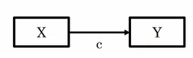
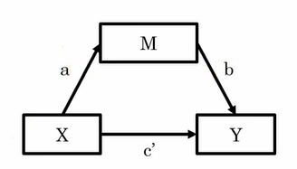
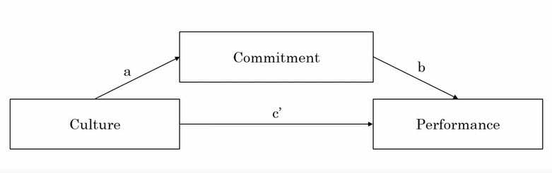

## Introduction

- Up to this point, we have focused on how to perform moderation analysis using the Process Macro.  

- Let's now examine how the influence between two constructs may take an indirect path through a third variable called a **mediator**.  

- In this situation, the third variable will intervene on the influence of the two constructs [@hair2009multivariate].  

- In testing if "mediation" or the presence of a mediator in a model, you need to understand some of the terminology that is used, such as **direct effect, indirect effect,** and **total effect".  

**Discussion on Direct Effect, Indirect Effect, and Total Effect**

  

```
c in the relationship between X and Y is the total effect.
```

**Direct-Indirect-Effect**



A direct effect is simply a direct relationship between an independent variable and a dependent variable in presence of the Mediator (c’).

An indirect effect is the relationship that flows from an independent variable to a mediator and then to a dependent variable **(a*b)**.

The term total effect is the combined influence of the direct effect between two constructs and the indirect effect flowing through the mediator ().

## How to Test Mediation?



Mediation Model Framework

We want to examine if the construct of Culture has an indirect effect through Commitment on the construct of Organizational Performance.

## How

## Reading the Output

Description of Model along with the different variables where Y is the Dependent Variable, X is the Independent Variable, and M is the Mediating Variable.
[Insert Image Here]

Notice that for this example there are two Model Summary presented.


**Model Summary 1**

Culture -> Commitment

Model Summary, provides summary of the model with R, , F statistic, and  value for the overall model.

Next, is the coefficient, with impact of Culture on Commitment.

Culture has a significant impact on Commitment. This is path a.

**Model Summary 2**

[Culture & Commitment] -> Performance

Culture has a significant impact on OP (b = 0.2917, t = 5.5426, p < 0.001). Here, this is the Direct effect (c’).

Commitment was also found to have a significant impact on OP (b = 0.4530, t = 8.5392, p < 0.001). This is path b.

