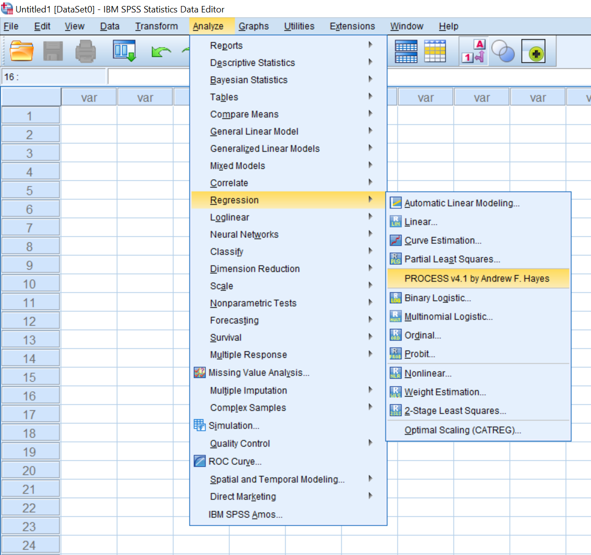
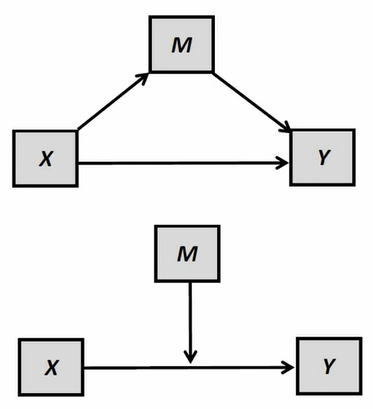

Welcome to the [SPSS Process Macro](/) workshop! We look forward to meeting you. Before attending the workshop, please complete the following prework.

## Installations

+ Go to process macro website to download the package [Download Process Macro](https://www.processmacro.org/download.html)  

+ Extract the Process Macro .zip file downloaded.  

+ in SPSS, go to `Extension` - `Utilities` - `Install Custom Dialog` (Compatibility Mode)  

+ In dialog box File name, locate your `process.spd` file, then click Open  

+ Your Process Macro can be found under the tab Analyze - Regression  

  

## Introduction  

### What is Process Macro?  

- PROCESS is an observed variable OLS and logistic regression path analysis modeling tool.

- The PROCESS macro is developed by Andrew F. Hayes.

- It is widely used through the social, business, and health sciences for estimating direct and indirect effects in single and multiple mediator models (parallel and serial), two and three way interactions in moderation models along with simple slopes and regions of significance for probing interactions, and conditional indirect effects in moderated mediation models with a single or multiple mediators or moderators.

### What is "Conditional Process Analysis"?

What is "Conditional Process Analysis?"

Conditional process analysis is a modeling strategy undertaken with the goal of

> describing the *conditional* or *contingent* nature of the *mechanism(s)* by which a variable transmit its effect on another, and testing hypotheses about such contingent effects.

**A melding of two ideas conceptually and analytically:**

- **Process analysis**, used to quantify and examine the direct and indirect pathways through which an antecedent variable *X* transmits its effect on a consequent variable *Y* throgh an intermediary *M*. This is better known as *mediation analysis* these days.

- **Moderation analysis**, used to examine how the effect of an antecedent *X* on a consequenr *Y* depens on a third moderator variable *M* (aka *interaction*).

